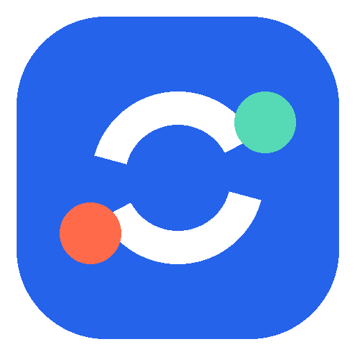

# codex-Turnloom

把正在电脑上运行的 Codex，完整延续到你的手机里。`codex-Turnloom` 是一个私有、自托管的远程工作台：手机通过局域网或 HTTPS 连接你的 Codex Desktop，查看会话、发送消息、跟踪工具调用，并在多台电脑之间快速切换。

它不替换 Codex Desktop，也不把对话上传到第三方云端；本机服务只负责把已有的 Codex 数据和操作安全地带到你的移动设备。

<p align="center">
  
</p>

> 正式标志由两个相互延续的开放环和两个彩色节点组成，表达 Codex 会话在电脑与手机之间持续流动。

## 功能

- 查看 Codex 对话、思考状态和工具调用
- 从手机发送、插入、排队、编辑或取消消息
- 查看对话中的图片并下载本地文件
- 为指定对话启用完成通知；空闲时不显示常驻监测通知
- 对话列表隐藏子 Agent 任务；保留桌面端置顶和手动项目分组，普通对话不按工作目录自动分类
- 扫码添加和切换多台电脑，并为每台电脑设置手机本地备注
- 系统返回键从会话页回到电脑列表，刷新或页面恢复时自动使用 APP 已保存的访问码
- Codex 数据目录迁移兼容
- Windows 服务与 SSH 隧道异常退出后自动恢复
- 电脑关机时停止，下一次 Windows 登录时恢复

## 结构

```text
server.js       Codex Desktop 本机服务与 IPC
public/         手机交互页面
android/        codex-Turnloom Android 源码
scripts/        安装、守护和设备二维码工具
test/           服务端回归测试
docs/           多电脑部署与安全说明
```

## 新电脑部署

前置条件：Windows 10/11、Codex Desktop、Node.js 18+、Git。克隆私有仓库后运行：

```powershell
npm ci
.\scripts\install-windows.ps1 -MachineName "办公室电脑"
```

如果需要通过公网访问，需要为每台电脑分配独立的服务器回环端口和公网 URL：

```powershell
.\scripts\install-windows.ps1 `
  -MachineName "办公室电脑" `
  -CodexHome "<Codex 数据目录>" `
  -PublicUrl "https://office.example.com" `
  -TunnelHost "server.example.com" `
  -TunnelUser "codextunnel" `
  -RemotePort 29002 `
  -SshKeyPath "$env:USERPROFILE\.ssh\codex_pocket_office_ed25519"
```

安装完成后会显示 APP 可识别的设备二维码。以后可重新显示：

```powershell
npm run device:qr
```

完整步骤见 [Windows 多电脑部署](docs/WINDOWS_MULTI_COMPUTER.zh-CN.md)。Codex 自动部署规则见 [AGENTS.md](AGENTS.md)。

## Android

测试与构建：

```powershell
npm run android:test
npm run android:build
```

调试 APK 位于 `android\app\build\outputs\apk\debug\app-debug.apk`。

APP 支持三种设备导入内容：

- `codexpocket://add?...` 设备二维码（旧协议继续兼容）
- 含 `login` 或 `token` 参数的 HTTP(S) URL
- `{ "name": "...", "url": "...", "token": "..." }` JSON

完成提醒使用 Android WorkManager。手机发出任务或开启提醒后会立即开始跟踪运行中的对话；其余时间由系统周期任务兜底，因此不会再为后台监测显示常驻通知。

## 验证

```powershell
npm test
npm run check
npm run android:test
```

PowerShell 部署脚本同时兼容 Windows PowerShell 5.1 和 PowerShell 7。GitHub Actions 会在每次推送后运行服务端测试并构建 Android 调试 APK。

## 本地配置与安全

仓库不会包含 Codex 数据、访问码、SSH 私钥、服务器凭据、每台机器的公网地址配置、APK、Gradle 缓存或运行日志。

Windows 本地配置保存在 `%LOCALAPPDATA%\CodexPocket\config.json`；这是旧版本兼容目录，升级时无需迁移。Android 端保存的设备访问码使用 Android Keystore 加密。公网入口应由 Caddy/Nginx 提供 TLS，并只将服务器本机回环端口转发给对应电脑。

## 来源与许可

服务端基于 MIT 许可的 `dreamingboat/codex-lan-companion` 扩展。当前项目是非官方个人工具，与 OpenAI 无关联。它依赖 Codex Desktop 的本地文件和 IPC 私有实现，Codex Desktop 更新后可能需要适配。
