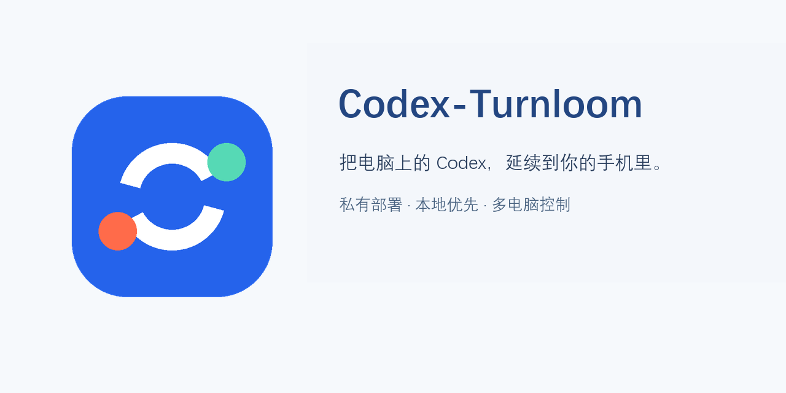
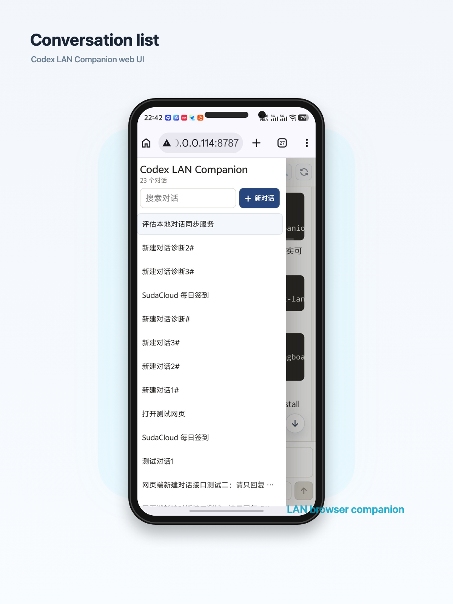
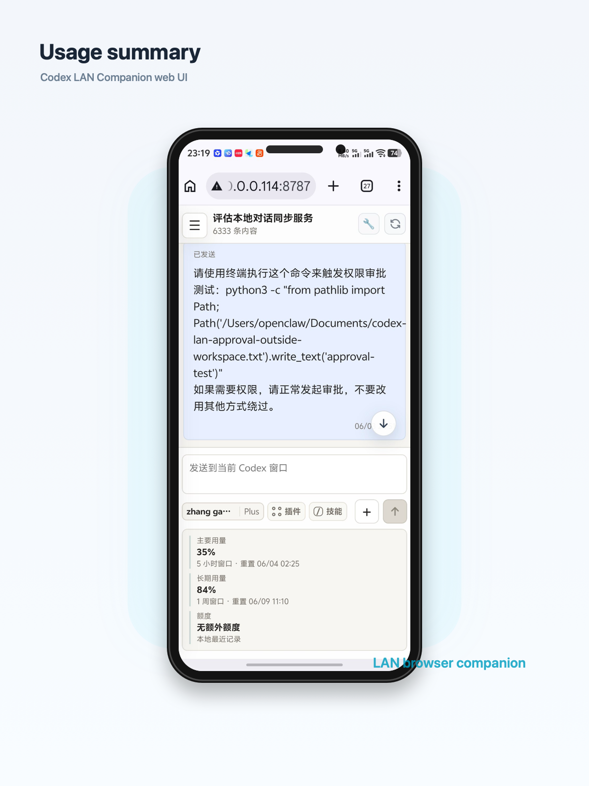
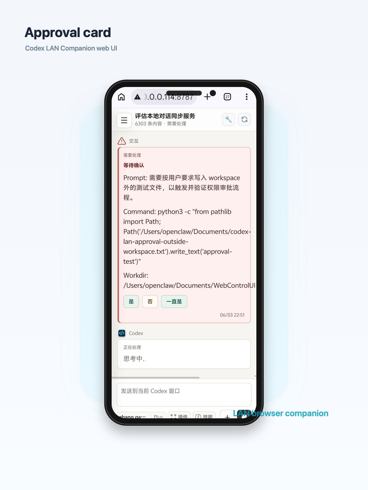
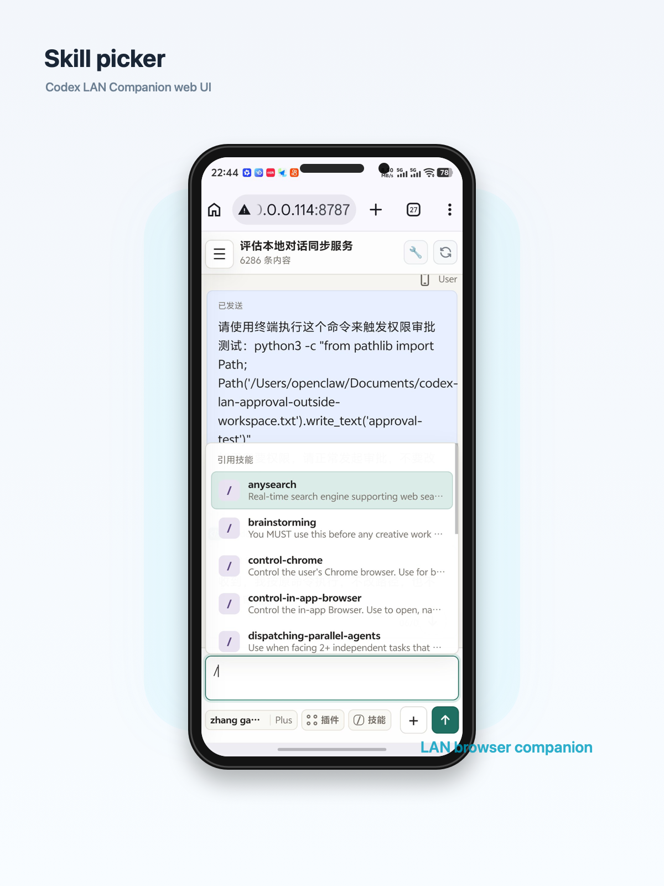
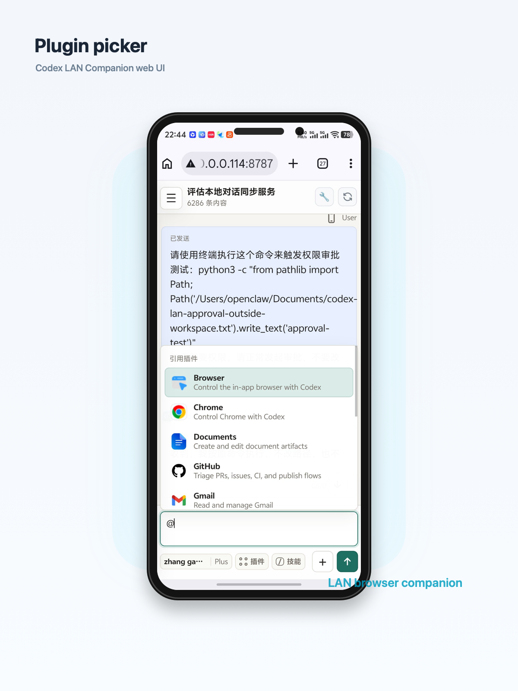

# Codex-Turnloom

  

Codex-Turnloom 是面向 Codex Desktop 的私有、自托管移动工作台。它让手机通过局域网或 HTTPS 连接正在运行 Codex 的电脑，在不使用远程桌面的情况下查看任务进度、继续对话、处理交互，并在多台电脑之间切换。

项目由本机服务、移动 Web 界面和 Android APP 组成。对话和文件仍保存在自己的电脑上，服务只负责把 Codex Desktop 已有的数据和操作转发到已授权的移动设备。

> 非 OpenAI 官方项目。它依赖 Codex Desktop 的本地数据和 IPC 接口，Codex Desktop 更新后可能需要同步适配。

## 功能概览

Codex-Turnloom 提供任务列表、消息同步、思考状态、工具记录、权限处理、目标编辑、任务分支、消息排队/插入、图片和本地文件转发、完成提醒、二维码配对、多电脑切换和手机本地缓存。

发布版本只使用脱敏的品牌素材；包含真实对话、文件路径或设备信息的界面截图不会进入仓库。

## 实机演示

以下截图来自实际手机端运行，用于展示主要交互流程。截图中的内容为测试数据，不包含访问码或私人对话。

<table>
  <tr>
    <td width="50%" align="center">
      
       
      <strong>任务列表</strong> 
      浏览任务、搜索会话并快速切换。
    </td>
    <td width="50%" align="center">
      
       
      <strong>任务详情</strong> 
      查看消息、输入区和用量信息。
    </td>
  </tr>
  <tr>
    <td width="50%" align="center">
      
       
      <strong>权限审批</strong> 
      在手机上处理 Codex 等待中的权限请求。
    </td>
    <td width="50%" align="center">
      
       
      <strong>技能选择</strong> 
      从输入区选择并插入可用技能。
    </td>
  </tr>
  <tr>
    <td width="50%" align="center">
      
       
      <strong>插件选择</strong> 
      选择已配置的插件并继续当前任务。
    </td>
    <td width="50%" align="center"></td>
  </tr>
</table>

## 主要功能

### 对话与任务

- 浏览 Codex Desktop 的主任务列表，保留置顶和手动项目分组
- 查看用户消息、Codex 回复、思考状态、工具调用和上下文压缩记录
- 显示任务运行、等待处理、完成和暂停等状态
- 查看和编辑 Codex 目标，在消息位置创建任务分支
- 已读取的对话缓存在手机本地，再次进入时先显示缓存并在后台同步最新内容

### 移动端操作

- 从手机创建新任务或继续现有任务
- 运行中可选择排队发送或插入当前任务
- 消息发送后立即进入对话区，并显示发送中、失败和重试状态
- 支持编辑或取消尚未发送的排队消息
- 支持图片附件、对话内图片预览和本地文件下载
- 网页链接交给手机默认浏览器打开，不覆盖当前 APP 页面

### 多电脑与通知

- 扫描二维码添加电脑，为设备设置手机本地备注
- 在一台手机上保存并切换多台 Codex 电脑
- 可为单独任务启用完成提醒，任务结束后发送系统通知
- 空闲时不保留无意义的常驻检测通知
- Android Keystore 加密保存设备访问码

### 稳定运行

- Windows 登录后静默启动，不弹出 PowerShell 或命令行窗口
- 本机服务、守护进程和 SSH 反向隧道异常退出后自动恢复
- 支持 Codex 数据目录迁移，并隔离不同数据版本的手机缓存
- 电脑关机后自然停止，下次开机登录时恢复服务
- 公网部署可由 Caddy 或 Nginx 提供 TLS，服务器只转发对应电脑的独立端口

## 工作方式

~~~text
Android APP / 手机浏览器
          |
          | 局域网 HTTP 或公网 HTTPS
          v
Codex-Turnloom 本机服务
          |
          +-- 读取 Codex 对话、目标、状态和文件
          +-- 通过本机 IPC 把操作发送给 Codex Desktop
~~~

它不是远程桌面，也不会把完整电脑画面传到手机。移动端只呈现 Codex 工作流需要的内容，因此在小屏幕上更易阅读和操作。

## 快速开始

### 环境要求

- Windows 10 或 Windows 11
- 已安装并运行 Codex Desktop
- Node.js 18 或更高版本
- Git

### 安装本机服务

~~~powershell
git clone <repository-url>
cd codex-Turnloom
npm ci
.\scripts\install-windows.ps1 -MachineName "办公室电脑"
~~~

安装程序会创建本机配置、启动静默守护服务，并输出 APP 可以识别的设备二维码。需要再次显示二维码时运行：

~~~powershell
npm run device:qr
~~~

完整步骤见 [Windows 多电脑部署](docs/WINDOWS_MULTI_COMPUTER.zh-CN.md)，当前部署约定和故障记录见 [运维说明](docs/OPERATIONS.md)。

## 公网访问与多电脑

每台电脑都应使用独立的隧道端口和公网地址，避免设备之间互相覆盖。下面的参数可按自己的服务器环境调整：

~~~powershell
$installArgs = @{
  MachineName = "办公室电脑"
  CodexHome = "<Codex 数据目录>"
  PublicUrl = "https://office.example.com"
  TunnelHost = "server.example.com"
  TunnelUser = "codextunnel"
  RemotePort = 29002
  SshKeyPath = "$env:USERPROFILE\.ssh\codex_turnloom_office_ed25519"
}
.\scripts\install-windows.ps1 @installArgs
~~~

服务器端建议使用 HTTPS 反向代理，并将每个公网入口映射到对应电脑的 SSH 反向隧道端口。

## Android APP

~~~powershell
npm run android:test
npm run android:build
~~~

构建完成后：

- 原始产物：android/app/build/outputs/apk/debug/app-debug.apk
- 稳定下载文件：public/downloads/Codex-Turnloom.apk
- 服务端下载接口：/api/apk

APP 支持扫描设备二维码、带 login 或 token 参数的 HTTP(S) 地址，以及包含 name、url、token 的 JSON 设备记录。旧版 codexpocket 协议和 CodexPocket 配置目录继续保留，以便已有安装平滑升级。

## 开发与验证

~~~powershell
npm test
npm run check
npm run android:test
npm run android:build
~~~

项目包含服务端协议、消息队列、对话分组、文件访问、静默启动和 Android 行为的回归测试。GitHub Actions 会在推送后运行服务端测试并构建 Android 调试 APK。

## 项目结构

~~~text
server.js       本机 HTTP 服务、Codex 数据读取与 Desktop IPC
public/         手机端界面、对话缓存和交互逻辑
android/        Android APP 源码
scripts/        Windows 安装、静默守护、隧道和二维码工具
test/           自动化回归测试
docs/           多电脑部署、安全和运维记录
~~~

## 安全与隐私

- 对话、目标和文件保留在运行 Codex Desktop 的电脑上
- 默认要求访问码；公网入口应始终启用 HTTPS
- 设备访问码在 Android 端使用 Keystore 加密保存
- 仓库不会提交 Codex 数据、访问码、SSH 私钥、服务器凭据、本机配置、APK 或运行日志
- 本地文件只在对话明确引用并通过授权校验后提供
- Windows 本地配置位于 %LOCALAPPDATA%/CodexPocket/config.json，不得提交到 Git

## 已知边界

- 电脑关机、休眠或断网时，手机无法继续访问该电脑
- Codex Desktop 的本地数据结构和 IPC 属于非公开实现，版本升级可能造成兼容性变化
- 公网可用性取决于本机服务、SSH 隧道、服务器反向代理和 TLS 证书均正常运行
- 当前 APK 是调试构建，正式分发前应配置独立签名和发布流程

## 来源与许可

服务端最初基于 MIT 许可的 dreamingboat/codex-lan-companion 扩展，现已加入 Android APP、多电脑管理、消息写入、任务状态、通知、文件转发、手机缓存和 Windows 静默守护等能力。

项目采用 [MIT License](LICENSE)。
